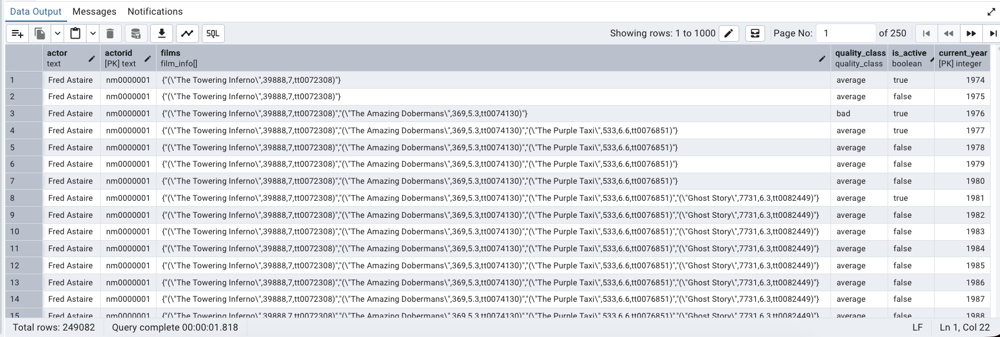
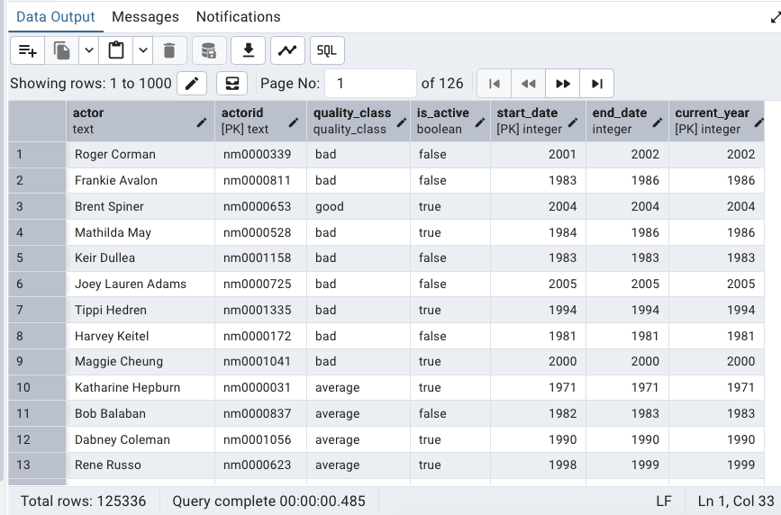

# Actor Films Dimensional Data Modeling

This project is a **dimensional data modeling** assignment built with **PostgreSQL**.
The goal is to transform an `actor_films` dataset into analytics-friendly tables using **cumulative table design** and **Slowly Changing Dimension Type 2** modeling.

The project focuses on modeling actor performance over time based on film ratings, activity status, and historical changes.

## Project Overview

The source dataset, `actor_films`, contains movie-level records for actors, including:

* Actor name
* Actor ID
* Film title
* Film year
* Votes
* Rating
* Film ID

Using this dataset, the project creates two main analytical tables:

### 1. `actors`

A cumulative table that stores one row per actor per year.

Each row contains:

* Actor information
* An array of all films up to that year
* The actor's quality class
* Whether the actor was active in that year
* The current year of the record

The `quality_class` is calculated based on the average rating of films from the actor's most recent active year:

| Quality Class | Condition                   |
| ------------- | --------------------------- |
| star          | Average rating > 8          |
| good          | Average rating > 7 and <= 8 |
| average       | Average rating > 6 and <= 7 |
| bad           | Average rating <= 6         |



### 2. `actors_history_scd`

A Slowly Changing Dimension Type 2 table that tracks changes in:

* `quality_class`
* `is_active`

This table stores historical periods using:

* `start_date`
* `end_date`
* `current_year`

This makes it possible to analyze how an actor's status changed over time.



## Technologies Used

* PostgreSQL
* pgAdmin
* Docker
* SQL
* Dimensional Data Modeling
* Slowly Changing Dimension Type 2

## Project Structure

```text
actor-films-dimensional-modeling/
│
├── README.md
├── docker-compose.yml
├── .gitignore
│
├── sql/
│   ├── 01_create_types.sql
│   ├── 02_create_actors_table.sql
│   ├── 03_load_actors_cumulative.sql
│   ├── 04_create_actors_history_scd.sql
│   ├── 05_backfill_actors_history_scd.sql
│   └── 06_incremental_actors_history_scd.sql
│
├── sample_outputs/
│   ├── actors_sample.csv
│   └── actors_history_scd_sample.csv
│
└── images/
    ├── actors_table_preview.png
    └── actors_history_scd_preview.png
```

## SQL Files

### `01_create_types.sql`

Creates custom PostgreSQL types:

* `quality_class`
* `film_info`
* `actors_scd_type`

### `02_create_actors_table.sql`

Creates the `actors` table.
This table stores cumulative actor data by year.

### `03_load_actors_cumulative.sql`

Populates the `actors` table from the `actor_films` dataset.

This query:

* Generates all years in the dataset
* Finds each actor's first active year
* Creates one row per actor per year
* Builds a cumulative film array
* Calculates quality class
* Marks whether the actor was active in that year

### `04_create_actors_history_scd.sql`

Creates the `actors_history_scd` table for historical tracking.

### `05_backfill_actors_history_scd.sql`

Populates the full SCD table in one query by detecting changes across all historical actor records.

### `06_incremental_actors_history_scd.sql`

Adds a new year of SCD data by combining:

* Historical SCD records
* Last year's active SCD records
* Current year actor data
* New, changed, and unchanged records

## Key Concepts Practiced

This project demonstrates:

* PostgreSQL custom types
* Arrays of composite types
* Cumulative table generation
* Window functions
* `LAG()`
* Change detection
* Slowly Changing Dimension Type 2
* Incremental data modeling
* Analytical table design

## Example Use Cases

The final tables can answer questions such as:

* Which actors were active in a specific year?
* How did an actor's quality class change over time?
* Which actors moved from average to good or star?
* Which actors became inactive after a certain year?
* What films had an actor appeared in up to a specific year?

## How to Run

1. Start PostgreSQL and pgAdmin using Docker.

Docker Setup:

This project was developed with PostgreSQL and pgAdmin running in Docker.

The original course environment used a `data.dump` file, but this repository includes only the required `actor_films.csv` dataset for easier reproduction.

Start the containers with:

```bash
docker compose up -d
```

Then open pgAdmin at:

http://localhost:5050

Email: admin@example.com
Password: admin


2. Create the source table:

```sql
CREATE TABLE actor_films (
    actor TEXT,
    actorid TEXT,
    film TEXT,
    year INTEGER,
    votes INTEGER,
    rating DOUBLE PRECISION,
    filmid TEXT
);
```

3. Import the CSV file from:

```text
data/actor_films.csv
```

into the actor_films table using pgAdmin's Import/Export tool.

4. Run the SQL files in this order:

```text
01_create_types.sql
02_create_actors_table.sql
03_load_actors_cumulative.sql
04_create_actors_history_scd.sql
05_backfill_actors_history_scd.sql
06_incremental_actors_history_scd.sql
```

## Notes

The project was developed using PostgreSQL in pgAdmin, with PostgreSQL and pgAdmin running through Docker.

The main goal of this project is to practice dimensional data modeling and historical data tracking in a realistic analytical workflow.
